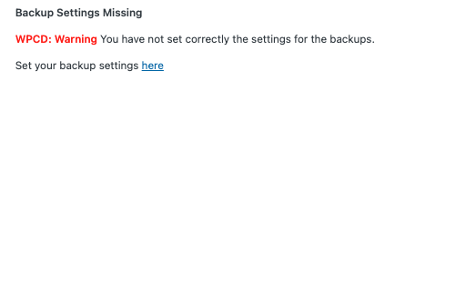

# WP Cloud Deploy Custom Backups Plugin

A plugin to do offline backups for **Application** to a VPS, a Synology box QNAP box or any machine that has SSH access ( password ).

## Settings page

A custom settings page exists in `/wp-admin//options-general.php?page=wpcd-custombackup`

Where you can set the `SSH Host`, SSH User, `SSH Password` , `SSH PORT`, `SSH Remote Dir Location`
> The SSH Passowrd is encrypted and saved in the DB via WPCD encrypt method.

## Settings Not set

## Application Backup Tab
Application tab with options:
- Enable backup compression
- Backup only Database
- Backup only Files
- Backup Database and Files

> The Backup pattern will be `SSH_REMOTELOCATION/SERVER_NAME/DOMAIN_NAME/DATE_TODAY/FILENAME`

